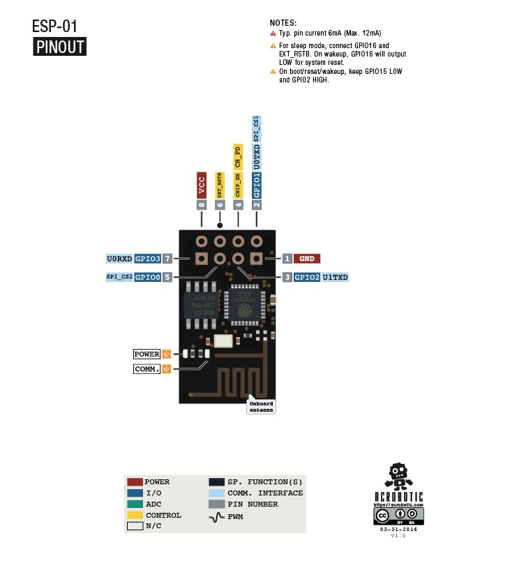

# ESP-01-Wifi-Modem
Está basado en el SoC (System on Chip) ESP8266, un chip altamente integrado, diseñado para las necesidades de un mundo conectado. Integra un potente procesador con Arquitectura de 32 bits y conectividad WiFi. Ofrece una completa y autocontenida solución WiFi Networking, permitiéndole trabajar como host de aplicaciones o reducir la carga de WiFi Networking de otro procesador.

ESPECIFICACIONES TÉCNICAS: 
        -Voltaje de Alimentación: 3.3V DC
        -Voltaje de Entradas/Salidas: 3.3V DC (No usar 5V)
        -SoM: ESP-12E (Ai-Thinker)
        -SoC: ESP8266 (Espressif)
        -CPU: Tensilica Xtensa LX3 (32 bit)
        -Frecuencia de Reloj: 80MHz/160MHz
        -Instruction RAM: 32KB
        -Data RAM: 96KB
        -Memoria Flash Externa: 4MB
        -Pines Digitales GPIO: 4
        -UART: 1
        -802.11 b/g/n
        -Wi-Fi Direct (P2P), soft-AP
        -Stack de Protocolo TCP/IP integrado
        -PLLs, reguladores, DCXO y manejo de poder integrados
        -Potencia de salida de +19.5dBm en modo 802.11b
        -Corriente de fuga menor a 10uA
        
        
